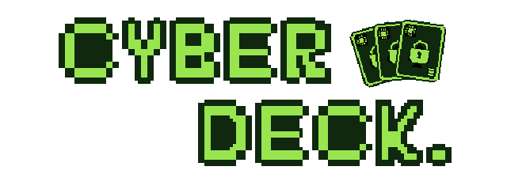

<p align="center">
  
</p>

<p align="center">
  Um jogo de cartas educativo sobre decisões de segurança digital para usuários não especialistas.
</p>

## Sobre

No Cyberdeck, o jogador enfrenta ameaças digitais escolhendo cartas que representam práticas de segurança. Algumas cartas são boas práticas. Outras são atalhos inseguros que rendem mais pontos na hora, mas abrem **brechas de segurança** que continuam causando prejuízo nas jogadas e rodadas seguintes.

A ideia central do jogo é mostrar que a consequência de uma decisão insegura pode não aparecer no mesmo momento em que ela é tomada.

O projeto é desenvolvido como Trabalho de Conclusão de Curso do Bacharelado em Ciência da Computação da Universidade Estadual de Maringá (UEM), com o título *Gamificação na Segurança Digital: Desenvolvimento e Avaliação de um Jogo Eletrônico para Conscientização de Usuários*. O design partiu de uma Revisão Sistemática da Literatura sobre jogos sérios em segurança digital.

**Situação atual:** versão inicial funcional. A avaliação experimental com o público-alvo é a próxima etapa.

## Como jogar

Cada rodada apresenta uma ameaça com um **Índice de Risco**. O objetivo é alcançar esse valor em pontos usando no máximo três jogadas, com até três cartas por jogada.

A pontuação de uma jogada é calculada assim:

```
pontuação = soma da Proteção das cartas × produto da Vulnerabilidade das cartas
```

A Proteção soma e a Vulnerabilidade multiplica. As cartas de má prática têm Proteção baixa e Vulnerabilidade alta, então parecem vantajosas: multiplicam a jogada inteira. O custo vem depois.

### Brechas de segurança

Cartas de má prática abrem brechas, que seguem este ciclo:

1. **Abertura.** A brecha é aberta pela carta insegura, mas só começa a valer a partir da jogada seguinte.
2. **Penalidade.** Enquanto a brecha estiver aberta, cada jogada perde uma porcentagem da pontuação.
3. **Persistência.** A brecha continua aberta entre rodadas e entre cenários.
4. **Exploração.** Ameaças de rodadas posteriores podem explorar uma brecha aberta, e isso aumenta o Índice de Risco daquela rodada.
5. **Correção.** Cartas específicas de boa prática fecham a brecha.

Se o jogador perde uma rodada, as brechas voltam ao estado em que estavam no início dela.

## Conteúdo

### Cenários

| Cenário | Tema | Brecha principal |
|---|---|---|
| E-mail suspeito | Phishing, anexos e links maliciosos | Dispositivo comprometido |
| Senhas | Reutilização de senhas e vazamento de credenciais | Credenciais expostas |

Cada rodada tem um baralho próprio. As cartas novas vão sendo apresentadas aos poucos, em vez de aparecerem todas na primeira rodada.

### Cartas

| Carta | Proteção | Vulnerabilidade | Efeito |
|---|---|---|---|
| Senha Forte | 35 | ×1.0 | |
| Autenticação em Dois Fatores | 20 | ×1.5 | |
| Verificar o Remetente | 30 | ×1.5 | |
| Utilizar senhas exclusivas | 55 | ×1.0 | Fecha *Credenciais expostas* |
| Antivírus Atualizado | 40 | ×1.0 | Fecha *Dispositivo comprometido* |
| Reutilizar Senha | 10 | ×2.0 | Abre *Credenciais expostas* |
| Clicar em Link Suspeito | 5 | ×2.0 | Abre *Dispositivo comprometido* |
| Abrir Anexo Desconhecido | 10 | ×2.0 | Abre *Dispositivo comprometido* |

## Recursos

- **Tutorial guiado** por um assistente, com destaque visual nos elementos da interface que estão sendo explicados.
- **Painel educativo**: ao passar o mouse sobre uma carta, aparece uma explicação sobre a prática que ela representa.
- **Enciclopédia**, acessível pelo menu principal e pelo menu de pausa. Reúne as cartas encontradas, agrupadas por tema. As que ainda não apareceram ficam bloqueadas, com as informações substituídas por `?`.
- **Revisão ao fim de cada cenário**, com as práticas que apareceram nele e a indicação das cartas novas.
- **Registro de métricas de sessão**, usado na avaliação experimental (detalhes abaixo).

## Como executar

**Requisito:** [Godot Engine](https://godotengine.org/) 4.7.1.

1. Clone o repositório:
   ```
   git clone https://github.com/lucasfratus/cyberdeck.git
   ```
2. Abra o Godot e importe o projeto selecionando o arquivo `project.godot`.
3. Pressione **F5** para executar. O jogo começa pelo menu principal.

O projeto usa o renderizador de compatibilidade (GL Compatibility), o que permite a exportação para a web (HTML5).

### Controles

| Ação | Comando |
|---|---|
| Selecionar e jogar cartas | Mouse |
| Ver a explicação de uma carta | Passar o mouse sobre a carta |
| Avançar um diálogo | Clique na caixa de diálogo, botão *Continuar* ou Enter |
| Pausar | Esc |

## Ferramentas para a avaliação experimental

Em build de depuração, que inclui a execução pelo editor e as exportações com a opção *Export With Debug*, o jogo mostra recursos voltados às sessões de avaliação:

- **Código do participante** no menu principal. Ele identifica o arquivo de métricas e permite relacioná-lo às respostas dos questionários.
- **Abrir pasta das sessões**, que abre a pasta onde os registros são gravados.
- **Limpar coleção**, na enciclopédia, que apaga o registro de cartas encontradas para o próximo participante começar do zero.

Cada sessão gera um arquivo JSON em `user://sessions/`, gravado de novo a cada evento. O arquivo registra o início e o fim de cenários e rodadas, cada jogada com as cartas usadas, as práticas inseguras, a pontuação e as brechas abertas ou fechadas, o tempo de leitura dos painéis educativos e as aberturas da pausa e da enciclopédia. No topo do arquivo, um bloco `summary` traz os totais já calculados.

## Estrutura do projeto

```
assets/        fontes, ícones, ilustrações das cartas, logo, shaders e temas
data/          conteúdo do jogo em Resources: brechas, diálogos, rodadas e cenários
gameplay/      regras: baralho, rodada, pontuação e dados de cenário e rodada
globals/       identificadores de cartas, nomes de categorias e paleta de cores
managers/      autoloads: banco de cartas, coleção de cartas encontradas e registro de sessão
scenes/        cenas e scripts: partida, cartas, mão, diálogos, enciclopédia e menus
tests/         cenas de teste dos componentes de cartas, mão e baralho
```
## Créditos

Desenvolvido por **Lucas de Oliveira Fratus**, sob orientação do **Prof. Dr. Alisson Renan Svaigen** e **Prof. Me. Felippe Fernandes da Silva**, no Departamento de Informática da Universidade Estadual de Maringá.

- Motor: [Godot Engine](https://godotengine.org/)
- Fontes: Atkinson Hyperlegible e Atkinson Hyperlegible Mono, do Braille Institute. A licença da versão Mono (SIL Open Font License 1.1) está em `assets/fonts/OFL-AtkinsonHyperlegibleMono.txt`.
